  

# Gopyr
**Informatics student at Gunadarma. I build small useful software and ship it.**

> [GP-1](https://github.com/Gopyr/GP-1) is my main project. Reproducible HTTP performance toolkit. Lab run 25 to 400 workers, 4605 req, 287 MiB, p95 476 ms, 0 failed on a loopback target I own. [Report](https://github.com/Gopyr/GP-1/blob/main/experiments/results/saturation-2026-08-22/SATURATION-REPORT.md)

## Currently building
* GP-1 v0.2.0 with compare view and HTML reports
* Lab Board dashboard for GP-1 reports
* VClass offline sync engine in Kotlin
* EdgeShield: hardened anti-DDoS fork, live-protecting this VPS from floods
* OpenRA mod: 8 new tank & ship units (M1 Abrams, Battlecruiser, SSBN)

## Selected work
| Project | What it is | Link |
|---|---|---|
| GP-1 | HTTP performance toolkit. Bounded, mode based, evidence first | [Gopyr/GP-1](https://github.com/Gopyr/GP-1) |
| Lab Board | Visual board for GP-1 JSON reports | [Gopyr/labboard](https://github.com/Gopyr/labboard) |
| VClass Sync | Offline first sync engine for VClass | [Gopyr/vclass-sync](https://github.com/Gopyr/vclass-sync) |
| TraceLens | Local proxy that captures latency and status | [Gopyr/tracelens](https://github.com/Gopyr/tracelens) |
| EdgeShield | OpenResty anti-DDoS fork, hardened & tested live against floods | [Gopyr/Nginx-Lua-Anti-DDoS](https://github.com/Gopyr/Nginx-Lua-Anti-DDoS) |
| OpenRA Mod | Fork of OpenRA with 8 modern tank & ship units added | [Gopyr/OpenRA](https://github.com/Gopyr/OpenRA) |
| Vclass App | Android companion for V-Class Gunadarma | [Gopyr/Vclass-App](https://github.com/Gopyr/Vclass-App) |

More on [repositories](https://github.com/Gopyr?tab=repositories). Older experiment `Advanced Layer 7 Stress Test Tool` is deprecated, use GP-1.

## Stack
`TypeScript` `React` `Vite` `Kotlin` `Compose` `Node` `Python` `REST` `Git`

  

## Contact
Open an issue or PR for bugs and ideas. I review small focused contributions fast.

[github.com/Gopyr](https://github.com/Gopyr) · [activity](https://github.com/Gopyr?tab=overview&from=2026-01-01&to=2026-12-31)

Built with curiosity, shipped incrementally.
