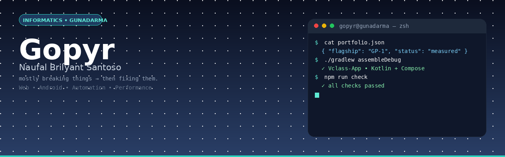

 

# Gopyr — mostly breaking things, then fixing them

Informatics student @ **Universitas Gunadarma** — I build small, useful software across **web, Android, and automation**. I like readable code, honest docs, and shipping incrementally.

> **[GP-1](https://github.com/Gopyr/GP-1)** — reproducible HTTP performance toolkit. Latest lab run: `25→400 workers` · `4,605 req` · `287.81 MiB` · `p95 476.07 ms` · `0 failures` — all measured on a project-owned loopback target.

---

### What I ship

| Area | Stack | Proof |
|---|---|---|
| **Web** | React / Vite / API modules | [Payment-Gateway](https://github.com/Gopyr/Payment-Gateaway) · QRIS flow prototype |
| **Android** | Kotlin / Jetpack Compose | [Vclass-App](https://github.com/Gopyr/Vclass-App) · V-Class companion (courses, forum, quiz) |
| **Automation** | Node / Discord API | [discord-vercel](https://github.com/Gopyr/discord-vercel) · plugin bot + dashboard |
| **Lab tools** | Python · CLI | [autorecon](https://github.com/Gopyr/autorecon) · [subenum](https://github.com/Gopyr/subenum) · [logparse](https://github.com/Gopyr/logparse) · [syscheck](https://github.com/Gopyr/syscheck) |

### Spotlight

**[GP-1](https://github.com/Gopyr/GP-1)** is the main project — bounded by default, mode-based, and evidence-first. No attack modes, no evasion. Reports include throughput, MiB/s, status codes, and p50/p95/p99. See [saturation report](https://github.com/Gopyr/GP-1/blob/main/experiments/results/saturation-2026-08-22/SATURATION-REPORT.md).

> Previous experiment `Advanced-Layer-7-Stress-Test-Tool` is now **deprecated — use GP-1**.

---

### How I work
- Start with the smallest useful version
- Keep the interface obvious, document the limits honestly
- Prototype = labelled as prototype, no polished fiction

### Stack
`JavaScript` `TypeScript` `React` `Vite` `Kotlin` `Compose` `Node.js` `Python` `REST` `Git`

---

 

### Let's build
Open an issue or PR if you have a reproducible bug or a focused idea. I review small, well-scoped contributions fast.

**Find me:** [github.com/Gopyr](https://github.com/Gopyr) · [repos](https://github.com/Gopyr?tab=repositories) · [activity](https://github.com/Gopyr?tab=overview&from=2026-01-01&to=2026-12-31)

Built with curiosity, shipped incrementally.
